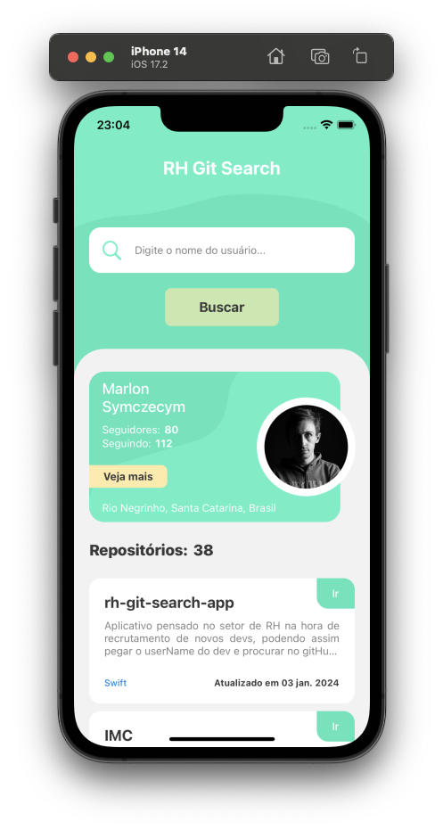
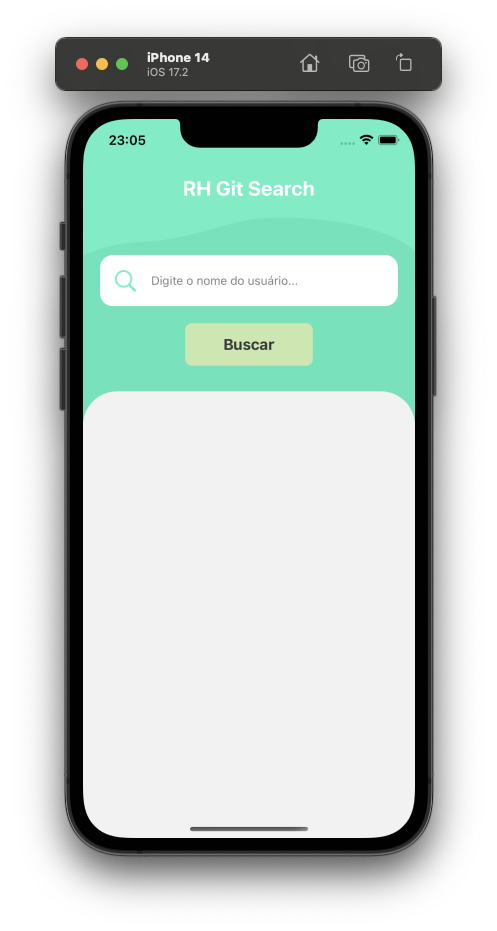
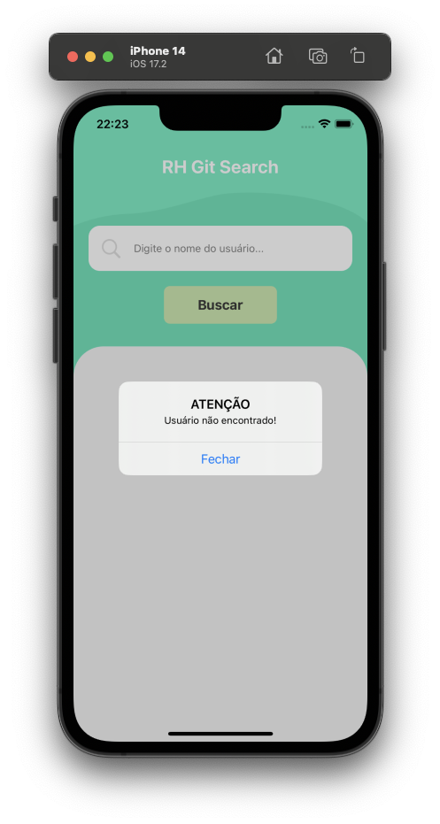
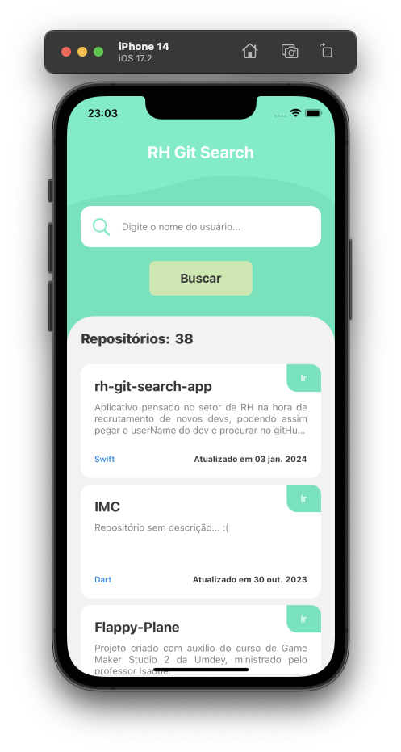

# RH Git Search

## Explicação

O layout produzido foi feito por mim mesmo Marlon Symczecym, e a parte da programação também.

Esse projeto foi desenvolvido para resolver um problema que talvez muitas pessoas de RH tenha, que é a de receber currículo de desenvolvedores e terem que olhar o seu GitHub, porém as vezes é muita informação e de difícil navegabilidade por pessoas que não estão acostumadas com a plataforma. Para isso desenvolvi o RH Git Search APP.

O layout que produzi foi com ajuda de referência vista no google, porém modifiquei algumas coias para que se encaixa-se na proposta do projeto. O intuito do layout era ser simples, elegante e de fácil compreensão por todos.
A tipografia escolhida foi a Inter, fonte sem serifa e arredondada, combinando perfeitamente com os elementos com bordas arredondas.
A paleta de cores foi escolhida para trazer elegância e suavidade, assim sendo feita toda monocromática em verde. Utilizado amarelo pastel e azul para dar enfâse em alguns elementos importantes como linguagens e botões.

Para tornar o layout mais intuitivo foram desenvolvidas algumas animações simples, mas que ao mesmo tempo deixam o layout mais leve. As animações foram desenvolvidas através do UIView.animate, sem utilizar frameworks de terceiros para que pudesse ser estudado mais a fundo e mantido com mais facilidade no futuro.

As informações que foram priorizadas para o usuário foram:

- Foto
- Nome Completo
- Seguidores
- Seguindo
- Localização

Para primeira apresentação essas informações são principais, mostra que o usuário procurado foi feito com sucesso.

As informações para a apresentação dos repositórios foram:

- Nome do repositório
- Descrição
- Linguagem
- Data da ultima atualização

Essas informações, muitas vezes são as que mais interessam as pessoas do RH, pois dá para ter uma boa visão dos projetos e de como foi mantido.

## Ferramentas

- Swift
- UIKit
- MockJson
- URLSession
- UIView.animate
- RegexBuilder

## Softwares utilizados

- Xcode
- GitKraken
- Trello
- Figma
- Postman

## Especificidades

Logo abaixo será mostrada imagens de como ficaram as telas.

- ## Tela Inicial

Essa é a tela inicial, onde mostra apenas o nome do projeto, o input para informar o nome do usuário dentro do gitHub, e o botão para buscar pelo usuário.

Para fazer a validações do textField foi utilizado RegexBuilder, assim fazendo com que a busca fosse mais assertiva.
O que o regex faz é controlar o isEnable do botão, se a condição for certa então o botão será ativado, senão manten-se desativado, não deixando o usuário apertá-lo.

A condição que foi colocado no regex foi:
- Máximo de palavras: 3 (separadas por espacos simples)
- 1 espaço simples a cada palavra
- Hífen entre palavras

- ## Tela de Erro

A tela para mostrar o erro, foi feito de maneira simplificada, só avisando, que não foi encontrado o usuário, e permitindo a busca por um outro nome após o fechamento do alert.

  

- ## Tela Completa

E finalmente a tela completa, é onde aparece todas as informações que se necessita, as informações já ditas lá em cima, mostrando o card do usuário logo abaixo do input, e mostrando abaixo do usuário todos os repositórios públicos que ele possui em sua conta do gitHub, podendo assim conferir também clicando sobre o repositório para ir direto para a página dele, e ver mais informações.

  
  

## Instruções de Uso

Para testar o projeto em questão, só seguir as seguintes dicas:

**Obs:** Precisa ter o xCode mais atualizado possível para que não dê erros ao abrir ou executar o próprio.

- Fazer o clone do projeto em seu pc, depois disso abrir ele no seu xCode, e executá-lo. Como o projeto não tem frameworks de terceiros não precisará esperar baixar nada externo.

## AUTOR

Marlon Symczecym

**Linkedin:** [Marlon Symczecym](https://www.linkedin.com/in/marlonsymczecym/)
